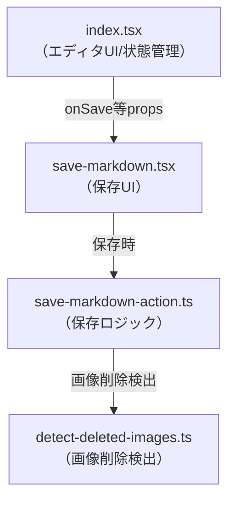

# edit-markdown保存処理リファクタリング計画

## 1. index.tsx整理案

- Formサブミット処理を`handleSaveMarkdown`等の専用関数に分離
- `removeDeletedImageUrls`は`detect-deleted-images.ts`等へ移動し、index.tsxから直接呼ばない
- index.tsxはエディタUI・状態管理のみ担当し、保存UI・ロジックはprops経由で受け取る

---

## 2. 保存UI/ロジックの移動先設計

- `src/feature/control-user-action/`配下に保存UI(`save-markdown.tsx`)・保存ロジック(`save-markdown-action.ts`)を新設
- 保存ボタン・進捗表示・エラーハンドリングもここで管理
- index.tsxは`onSave`等のpropsのみ受け取る

---

## 3. 実装手順（段階的移行案）

1. index.tsxのFormサブミット処理を専用関数に分離
2. `removeDeletedImageUrls`を`detect-deleted-images.ts`等へ移動
3. 保存UI/ロジックを`control-user-action/`配下に新設
4. index.tsxから保存UI/ロジックを削除し、props経由で受け取る形に修正
5. import/exportを整理し、依存関係を最小化
6. 動作確認・既存機能の維持をテスト

---

## 4. import/export変更点

- index.tsx: 保存ロジック・UIのimport削除、`onSave`等のprops型追加
- control-user-action/: `save-markdown.tsx`・`save-markdown-action.ts`をexport、必要な型・関数のみexportし内部実装は隠蔽

---

## 5. 完了後の責務分離イメージ

---

## 6. 注意点（feature間の依存禁止）

- featureディレクトリ内の関数・ロジックは、他featureから直接import不可
- 共通処理は`lib/`等に抽出し、feature間依存を避けること
- 保存ロジックや画像削除検出など、複数featureで使う場合は`lib/`配下に移動してexport